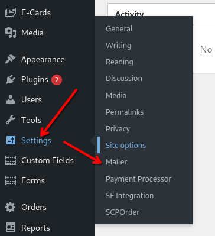
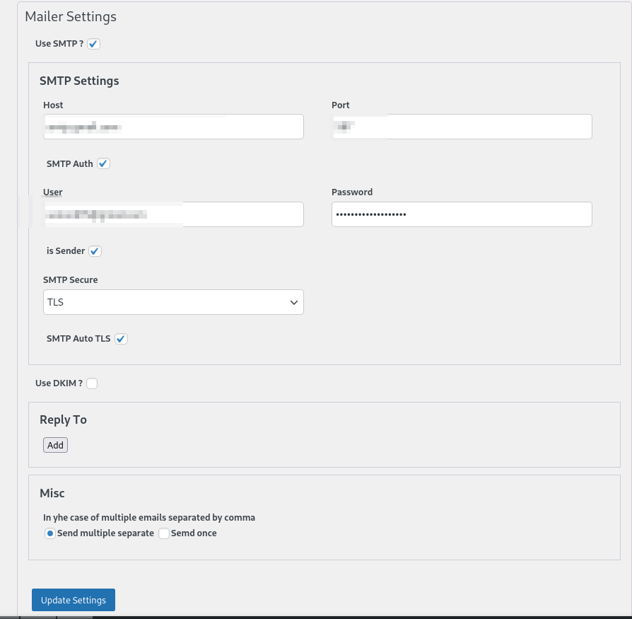
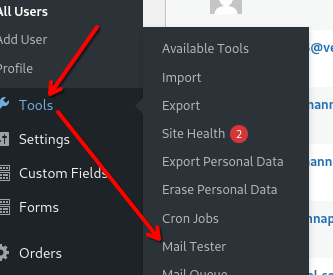
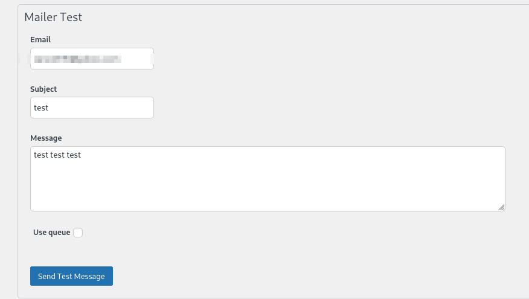
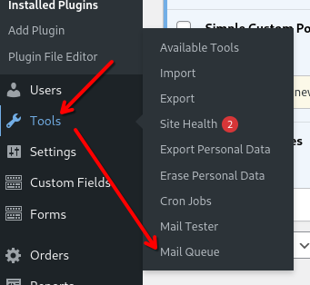
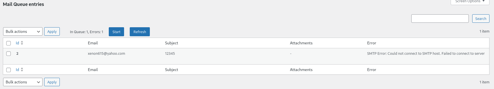

# Mail-Q
Designed for configuring and testing emails sent via WordPress.
Can create a sending queue.

## Installation
Place in the plugins folder and activate.

## Configuration 



## These settings affect PHPmailer's configuration and, therefore, all emails sent from the site.  

## Testing



## Queue



## Usage 
### Send Email

Although settings all emails sent from the site. no matter how they were sent
there is a possibility of explicitly using a plugin for sending

```php

$mailer = getMailer(false // keep alive SMTP connection);   
$mailer->send([
    'to' => 'some@somewhere.com',
    'subject' => 'test',
    'message' => 'Message',
    'headers' => [],
    'is-text' => true, // text/plain or text/html (default);
    'attachments' => [
        ['name' => 'Your_pdf.pdf', 'data' => $pdf_content]
    ],
    // 
    // 'attachments' => [
    //     ['name' => 'Your_pdf.pdf', 'path' => $path_to_pdf]
    // ],
]);

```
### Add to queue


```php

 $mail_q = getMailQ();
$mail_q->add([
    'email' => 'some@where.com',
    'subject' => 'hi',
    'message' => 'Hello World',
    'attachments' => [
        'name' => 'filename.pdf',
        'data' => $pdf_data
    ]
]);

$mail_q->run();  // If you don't do this, the queue will wait until you press the start button in the admin panel.

```

If the message is sent successfully, it is removed from the queue. Otherwise, an error is logged. If the queue is empty or contains only error messages, sending is stopped.
After clearing the errors, the sending can be repeated.


